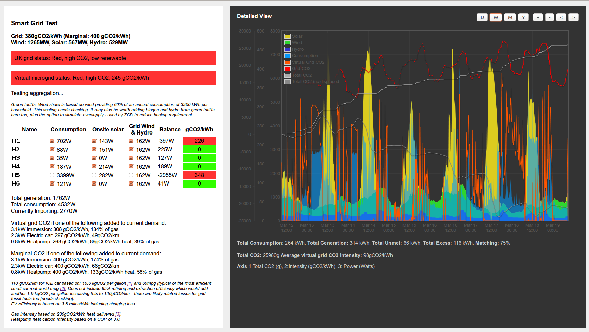

### VirtualSmartGrid

Open source virtual smart grid renewable energy aggregation and sharing concept with a focus on carbon metrics.

Contributors: Trystan Lea and Dominic McCann. 
Organisations: OpenEnergyMonitor and Carbon Coop

### Features

- Realtime and historic aggregation of household onsite solar and consumption data
- Realtime calculation of electricity CO2 Intensity based on level of import from the wider grid on a household and virtual microgrid basis.
- Estimation of marginal rate of CO2 Intensity if a load is switched on.
- UK Wind output forecast
- Selectable UK Grid supply mix: select whether to include nuclear, gas and coal or just gas as the backup source.
- Selectable level of grid wind and hydro - assuming households are on a green tariff with high  level of renewable energy in the supply mix.

### Architecture 

The software contained in this repository to produce the virtual microgrid dashboard fetches household solar and consumption data from participating user accounts on emoncms.org. It makes a local cached copy in order to provide a faster loading time and browsing experience. Emoncms.org is also open source, the source code can be found here [http://github.com/emoncms/emoncms](http://github.com/emoncms/emoncms/). The UK grid mix data is loaded from the ukgrid tool which needs to be running on the same server, the source code for which can be found here: [https://github.com/TrystanLea/ukgrid](https://github.com/TrystanLea/ukgrid).

### Licence

This software is licenced under the Free and Open Source software Gnu Affero General Public Licence.
